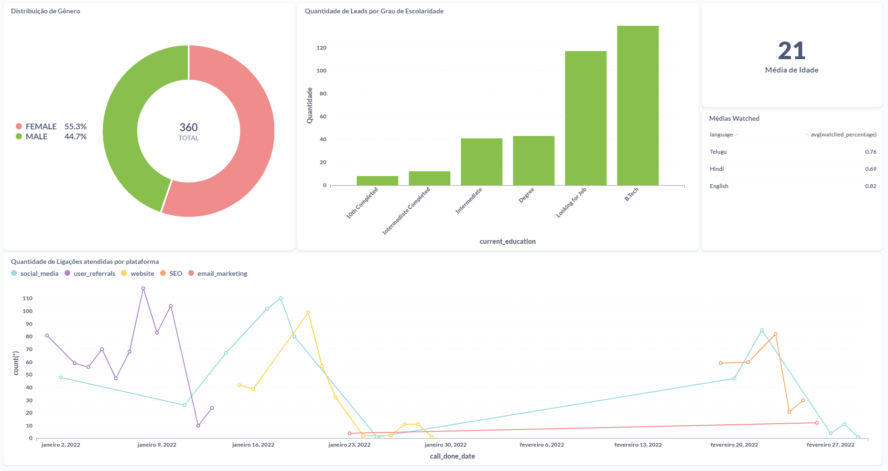

# 📊 Dashboards Power BI & Metabase - Curso Analista de Dados | Escola DNC  

Este repositório contém dashboards desenvolvidos no curso de **Analista de Dados da Escola DNC**. Aqui, publico projetos utilizando **SQL e Metabase**, explorando análise de dados e visualizações estratégicas.  

---

## 📂 **Projetos Publicados**  

### 📊 Dashboard SQL & Metabase  
**Análise e visualização de dados utilizando SQL e Metabase.**  
  

---

## 🔧 **Tecnologias Utilizadas**  
- **📊 Data Visualization:** Power BI, Metabase  
- **🗄️ Banco de Dados:** SQL, PostgreSQL, MySQL  
- **🐍 Programação:** Python (Pandas, NumPy)  

📩 **Contato:**  
📧 Email: [lucafsasso@hotmail.com](mailto:lucafsasso@hotmail.com)  
📱 WhatsApp: (11) 99560-7670  
🔗 [LinkedIn Profile](https://www.linkedin.com/in/luca-favilli-sasso/) 
