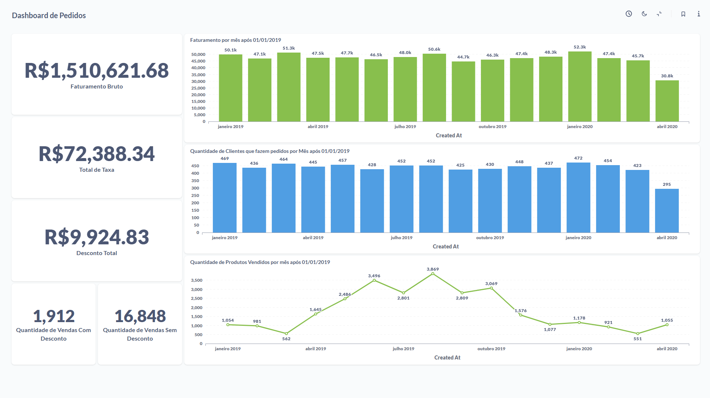
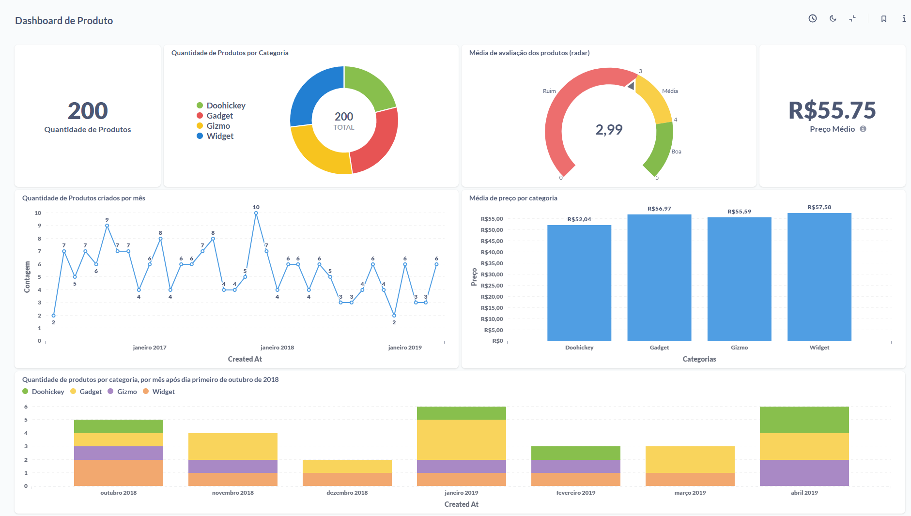
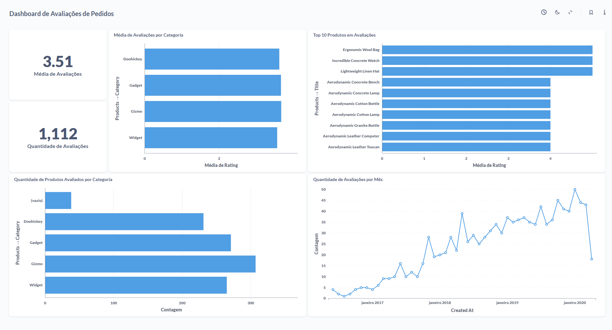
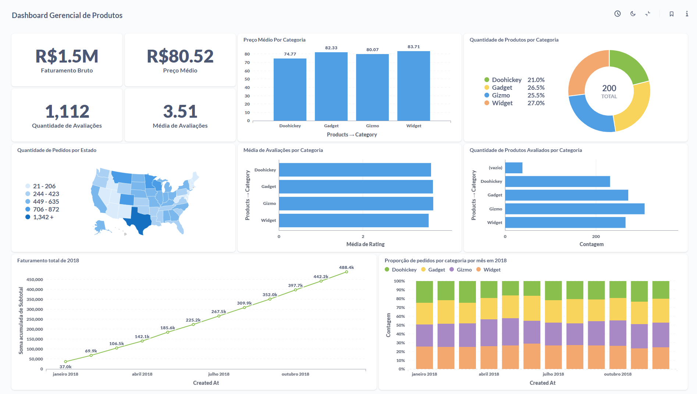

# 📊 Dashboards SQL & Metabase - Curso Analista de Dados | Escola DNC  

Este repositório contém dashboards desenvolvidos no curso de **Analista de Dados da Escola DNC**. Aqui, publico projetos utilizando **SQL e Metabase**, explorando análise de dados e visualizações estratégicas.  

---

## 📂 **Projetos Publicados**  

### 📊 Dashboard SQL & Metabase  
**Análise e visualização de dados utilizando SQL e Metabase.**  
  

### 📦 Dashboard de Pedidos  
**Análise detalhada dos pedidos, volumes de venda e tendências ao longo do tempo.**  
  

### 🏷️ Dashboard de Produto  
**Insights sobre a performance de produtos, vendas por categoria e comportamento de clientes.**  
  

### ⭐ Dashboard de Avaliação de Produto  
**Métricas de avaliação de produtos com base em feedbacks e classificações dos clientes.**  
  

### 📈 Dashboard Gerencial de Produto  
**Visão estratégica do desempenho de produtos, incluindo estoque, rentabilidade e sazonalidade.**  
  

---

## 🔧 **Tecnologias Utilizadas**  
- **📊 Data Visualization:** Metabase  
- **🗄️ Banco de Dados:** SQL, PostgreSQL, MySQL, Excel

📩 **Contato:**  
📧 Email: [lucafsasso@hotmail.com](mailto:lucafsasso@hotmail.com)  
📱 WhatsApp: (11) 99560-7670  
🔗 [LinkedIn Profile](https://www.linkedin.com/in/luca-favilli-sasso/) 
